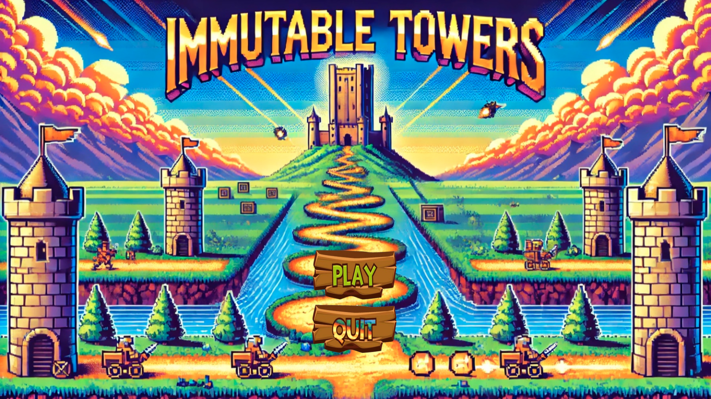
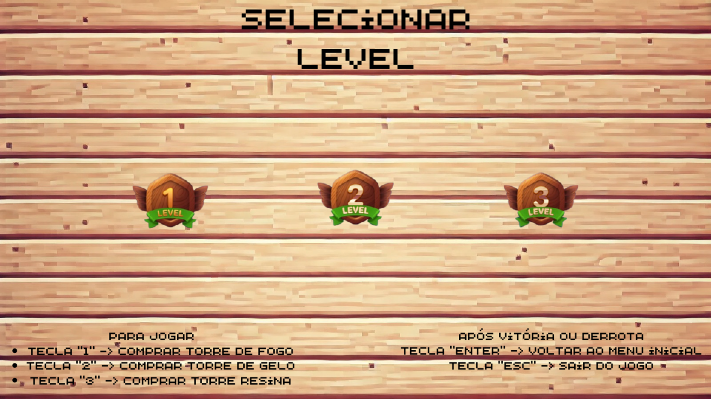
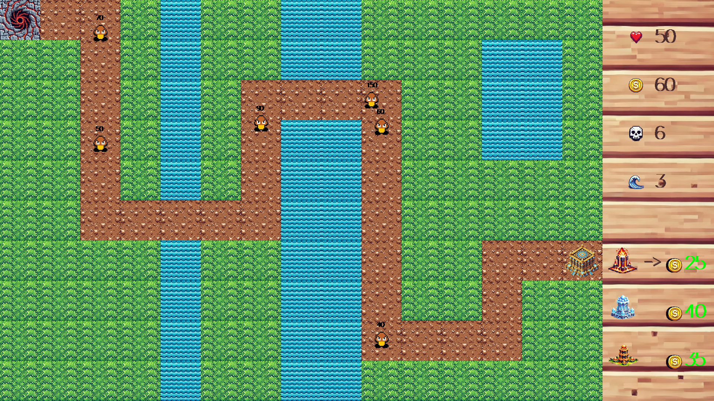

# Immutable Towers - LI1

A game based on the Tower Defense series, created in Haskell as part of the Laboratórios de Informática I course (1st year, 1st semester) in the Computer Engineering degree at the University of Minho, academic year 2024/25.

**The full project specification is available in the [`Enunciado.pdf`](Enunciado.pdf) file.**

## 📦 Executable

You can build and run the program using Cabal's `build` and `run` commands.

```bash
cabal run --verbose=0
```

## 🎮 Interpreter

To open the Haskell interpreter (GHCi) with the project loaded, use Cabal's `repl` command:

```bash
cabal repl
```

## 🧪 Tests

The project uses the [HUnit](https://hackage.haskell.org/package/HUnit) library for unit testing.

Run tests using Cabal's `test` command and use the `--enable-coverage` flag to generate a test coverage report.

```bash
cabal test --enable-coverage
```

You can run documentation examples as tests using the [`doctest`](https://hackage.haskell.org/package/doctest) library. To install the executable, use the command `cabal install doctest`.

```bash
cabal repl --build-depends=QuickCheck,doctest --with-ghc=doctest --verbose=0
```

## 📚 Documentation

Project documentation can be generated using [Haddock](https://haskell-haddock.readthedocs.io/).

```bash
cabal haddock
```
## Screenshots

### Home Page



This is the game's home page, where you can choose to play ("PLAY") or quit ("QUIT").

---

### Level Selection Menu



Here you choose the level you want to play: levels 1, 2, or 3.

At the bottom are basic instructions for playing and exiting the menu or the game.

---

### Game Interface (Example of Level 2)



In this image you can see the game map and, on the right, the status interface with the following information:

| Icon                                  | Meaning                                  |
|-------------------------------------|------------------------------------------|
|           | Base health.               |
|      | Credits available to buy towers (initially 60). |
|  | Number of defeated enemies (here 6).     |
|           | Number of waves passed (here 3).         |

At the bottom right is the shop, where you can buy towers:

- Fire Tower (costs 25 credits)  
- Ice Tower (costs 40 credits)  
- Resin Tower (costs 35 credits)  

---

## Towers

There are three types of towers you can buy and place on the map:

| Tower           | Image                           | Description                                                                                      |
|-----------------|--------------------------------|------------------------------------------------------------------------------------------------|
| Fire Tower      |    | Launches fire projectiles that damage enemies and apply damage over time.                      |
| Ice Tower       |     | Launches ice projectiles that temporarily freeze enemies, preventing movement.                 |
| Resin Tower     |  | Launches resin projectiles that indefinitely slow down enemies while active.                    |

---

## Enemies

Enemies appear in waves through portals on the map. Each enemy has:

- Health, shown as a number above their head.  
- Speed, which varies among enemies and waves.  
- When reaching the base, they cause damage that reduces the base health.  

Here is an image of a typical enemy:


---

## How to Play

1. Select the level in the menu.  
2. Buy towers in the shop using credits.  
3. Place towers on grass tiles to defend the base.  
4. Towers automatically attack enemies within their range.  
5. When an enemy is defeated, you earn credits to buy more towers.  
6. The goal is to prevent enemies from reaching the base until the level ends.

---

### 👥 Contributors:
- Gabriel Rodrigues  
- Simão Santos
